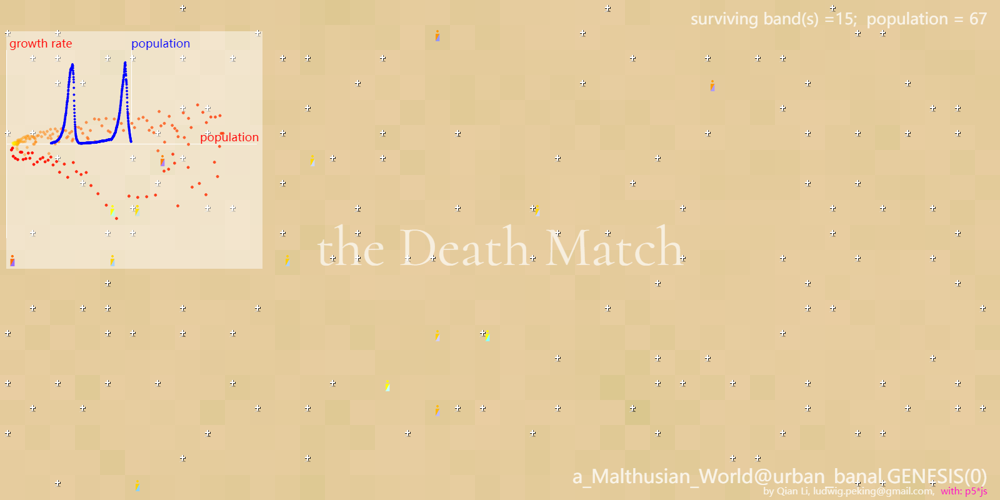
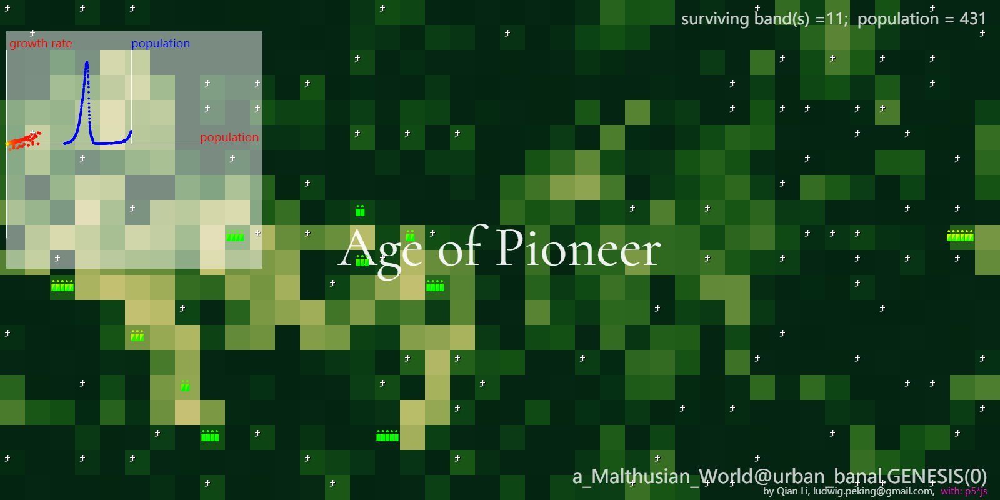
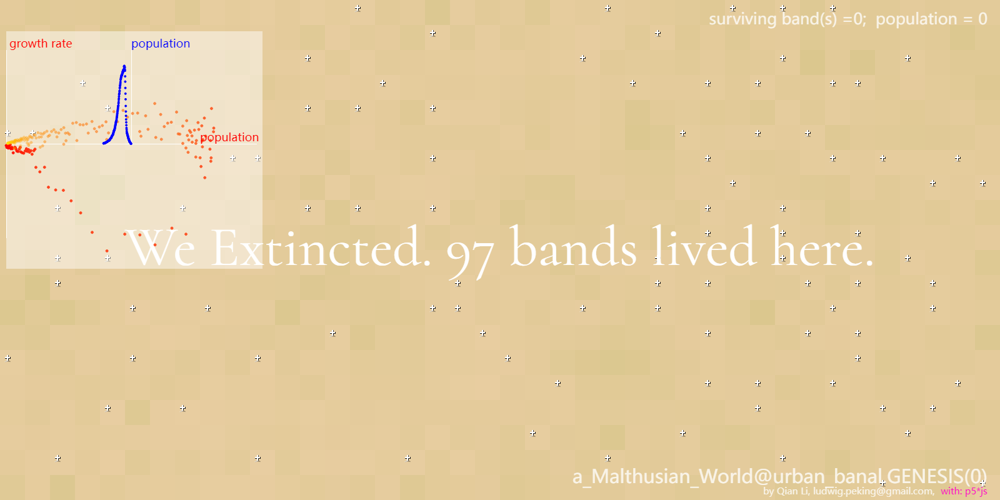

## Malthusian World Simulation

Author: Richard Qian Li, 2022. Javascript, p5 library.
This code is a simulation of a world governed by Malthusian principles. A Malthusian world refers to a scenario where the growth of a population is checked by limited resources.

In this simulation, the world consists of a grid where each cell can be occupied by a "band" of people. These bands can grow in size, move around, divide themselves into dispatches when the local resources are not enough to supply.  

### Malthusian Concepts in the Code:

1. **Resource and Population Dynamics:**
    - The code simulates the growth of resources and population on a grid. The carrying capacity of each cell in the grid is limited, akin to the Malthusian idea that resources (like food) grow at a linear rate, while the population can grow exponentially until checked by the lack of resources.

2. **Ages or States of the World:**
    - Different "ages" or states of the world (like "Age of Eden," "Age of Collapse") are determined based on the population and resource dynamics. This is analogous to the cycles of growth and decline in a Malthusian world.

3. **Population Movement and Utilization of Resources:**
    - Bands can move and exploit resources, similar to how human populations historically migrated and exploited new lands. However, in a closed, technologically stagnant society, these resources are finite and can be depleted.

### A Metaphor to a Closed, Technologically Stagnant Society:

1. **Limited Technological Progress:**
    - The code does not account for technological innovation that could increase the carrying capacity of the land. This mirrors a society where technological progress is slow or nonexistent, leading to a constant struggle for resources.

2. **Population Checks:**
    - Population growth is checked by the availability of resources. In a real-world Malthusian scenario, this would be analogous to famines, diseases, and other disasters that reduce the population when it exceeds the carrying capacity of the environment.

3. **Cyclical Nature:**
    - The simulation’s different “ages” reflect the cyclical nature of a Malthusian world. There are periods of prosperity when resources are abundant, followed by periods of decline as resources are depleted, and the population is checked.

### Reflection on Modern Society:

While modern society has largely escaped the Malthusian trap due to technological innovation, the simulation  underscores the importance of sustainable practices and innovations that increase our planet’s carrying capacity in a balanced manner, warning the dangers of some involutionary parts of the world that might drag us back into the Malthusian trap.
